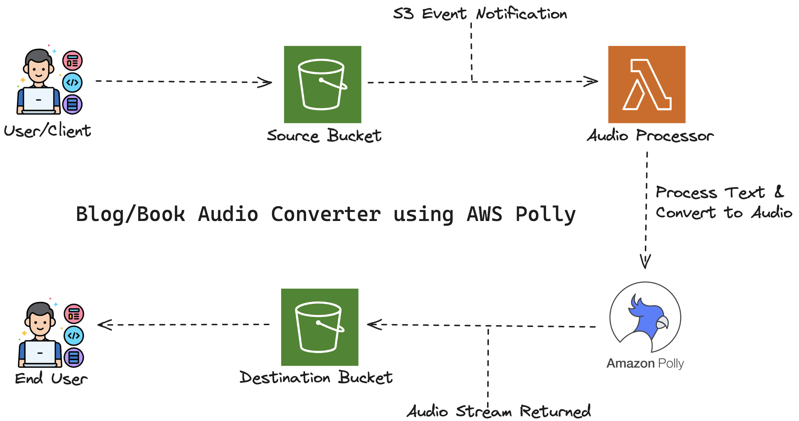

# Step-by-Step Guide to Building Blog/Book Audio Converter using AWS Polly

### Project Description:

The **Blog/Book Narrator** project leverages **AWS services** to convert text files (such as blog posts, articles, newsletters, or book excerpts) into **speech**. This solution makes written content more **accessible** and **engaging** by creating audio versions, catering to a wider audience — including those who prefer listening over reading.

## Use Cases

- **Content Accessibility**: Generates audio versions of written content, helping visually impaired users access information easily.
- **Learning**: Enables users to listen to educational materials, improving retention and enhancing the learning experience.
- **Content Distribution**: Offers an additional medium for content consumption, increasing user engagement and reach.
- **Convenience**: Allows users to listen to blogs, articles, or books while multitasking — such as during commutes, workouts, or daily routines.

### Project Architecture:



# Steps to Build the Project

---

### **Step 1: Set Up an AWS Account**
- Sign up or log in to your **AWS Management Console**.
- Ensure you have access to **Amazon S3**, **Amazon Polly**, and **AWS Lambda** services.

---

### **Step 2: Create Two S3 Buckets**
We need two S3 buckets:  
- **Source S3 Bucket Name:** `aws-text-polly-source-bucket` *(Stores input text files)*  
- **Destination S3 Bucket Name:** `aws-audio-polly-destination-bucket` *(Stores generated audio files)*  

---

### **Step 3: Create an IAM Policy**
- **IAM Policy Name:** `amazon-polly-lambda-policy`

#### **Policy Definition**

  ```bash
  {
    "Version": "2025-08-30",
    "Statement": [
        {
            "Effect": "Allow",
            "Action": [
                "s3:GetObject",
                "s3:PutObject"
            ],
            "Resource": [
                "arn:aws:s3:::aws-text-polly-source-bucket/*",
                "arn:aws:s3:::aws-audio-polly-destination-bucket/*"
            ]
        },
        {
            "Effect": "Allow",
            "Action": [
                "polly:SynthesizeSpeech"
            ],
            "Resource": "*"
        }
    ]
  } 
  ```

### Step 4: Create an IAM Role
- **IAM Role Name:** `amazon-polly-lambda-role`  
- Attach the following policies to the role:  
  - `amazon-polly-lambda-policy` *(created in Step 3)*  
  - `AWSLambdaBasicExecutionRole` *(built-in AWS policy)*  

This role will give the **Lambda function** the necessary permissions to access **S3 buckets** and **Amazon Polly**.

---

### Step 5: Create and Configure the Lambda Function
- **Lambda Function Name:** `TextToSpeechFunction`  
- **Runtime:** Python 3.8  
- **Execution Role:** Use the IAM Role created in **Step 4**  

This Lambda function will process input text files from the source bucket, convert them into speech using Amazon Polly, and save the resulting audio files to the destination bucket.

## Environment Variables:
Add Environment Variables
  - `SOURCE_BUCKET` → Name of your **source S3 bucket**  
  - `DESTINATION_BUCKET` → Name of your **destination S3 bucket**  


### Step 6: Configure S3 Event Notification
- Set up an **event notification** in the **source S3 bucket** to trigger the Lambda function whenever a new object is created with the `.txt` suffix.  
- This ensures that each time a text file is uploaded, the **TextToSpeechFunction** Lambda automatically processes it and generates the corresponding audio file in the destination bucket.


### Step 7: Write Lambda Function Code 
lambda_function.py

---

### Step 8: Test the System
  Deplay the code and place a .txt file in the souce bucket.
  Check cloudwatch for log events.